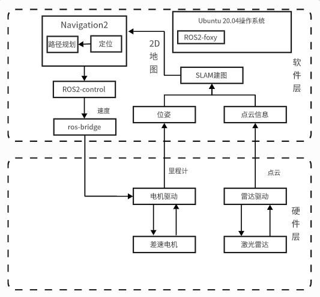
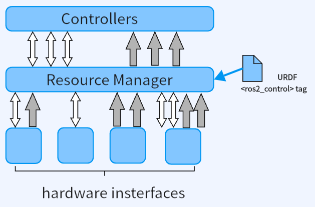
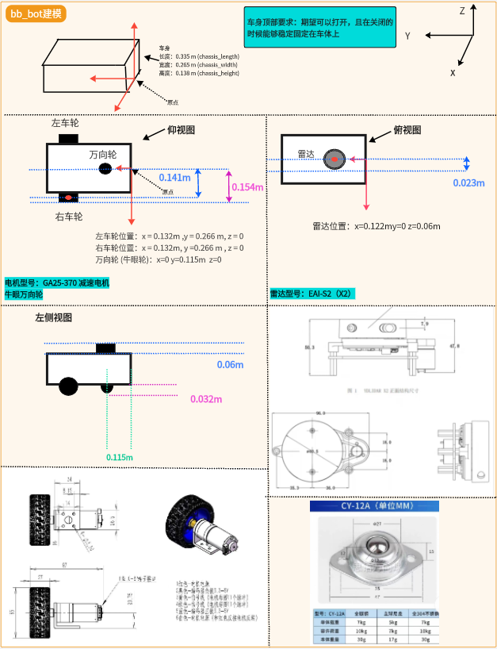

# bb_bot
ros2_control下的基于Nav2的自动导航机器人
## 系统架构
### 整体架构

### ros2_control

### 3D打印建模

## 环境要求
- 我在以下版本进行测试
    - Ubuntu 20.04
    - ROS2 foxy
    - ros2_control
### 安装ros2-control
```
$ sudo apt install ros-foxy-ros2-control ros-foxy-ros2-controllers ros-foxy-gazebo-ros2-control

```
### 安装slam-toolbox
```
$ sudo apt install ros-foxy-slam-toolbox

```

## 构建
1. 克隆这个仓库到你的工作空间
```
$ mkdir -p colcon_ws/src
$ cd ~/colcon_ws/src
$ git clone https://github.com/shakimaaa/bb-robot.git
```

2. 更改这里的包名 [line](bb_bot/launch/launch_sim_test.launch.py#L20) 为你自己的

3. build
```
$ cd ~/colcon_ws
$ //编译仿真
$ colcon build --symlink-install --packages-select bb_bot
$ 编译雷达驱动包
$ colcon build --symlink-install --packages-select ydlidar
```

## 启动仿真
```
$ source intall/setup.bash
$ ros2 launch bb_bot launch_sim_test.launch.py
```

## 启动雷达
```
$ source intall/setup.bash
$ ros2 launch ydlidar ydlidar_launch.py
```
